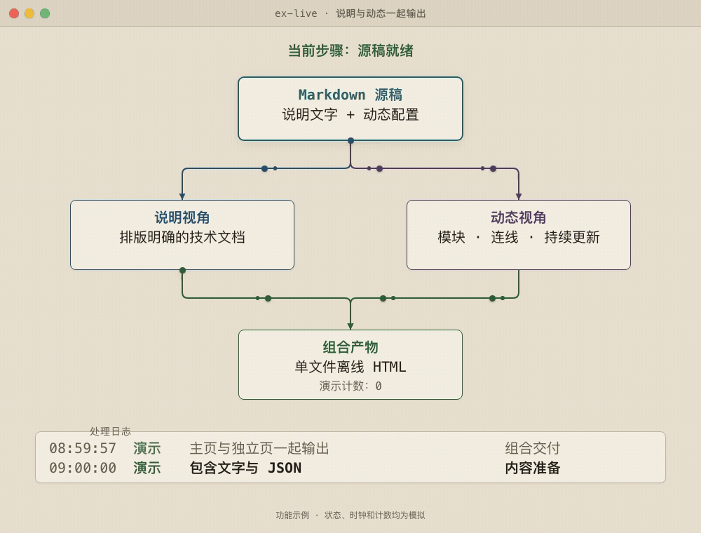

# ex-live

一次调用，把技术说明和动态架构图放进同一个 HTML。说明讲清楚结论、依据和取舍，动画展示模块、连线和状态。主文件可离线分享，也会生成独立动态面板。

## 架构与效果

下面的图由 **ex-live 自己生成**，使用默认的 `warm` 模板。
一份 Markdown 源稿包含说明文字和动态配置，由两套渲染器生成组合页面。

[](examples/assets/architecture.png)

[查看静态大图](examples/assets/architecture.png) · [查看生成源稿](examples/readme.md)

GitHub README 展示的是 12 秒 GIF 预览。完整 HTML 支持暂停、继续和离线播放。图中的状态、日志和计数均为模拟。

## 在 Agent 中调用

你只需提供目标和材料，Agent 会准备说明文字与动态配置。材料可以是当前仓库、文档路径或已确认的流程。

### Pi

在终端安装：

```bash
pi install git:github.com/freshgame-oss/ex-live
```

回到 Pi 会话，依次输入：

```text
/reload
/skill:ex-live 阅读当前仓库，解释请求从入口到数据库的路径。用 warm 模板生成说明和动态架构图。
```

### Claude Code、Gemini CLI 与其他宿主

将完整仓库放入宿主的技能目录。按所用宿主选择一个位置：

| 宿主 | 技能目录 |
| --- | --- |
| Claude Code | `~/.claude/skills/ex-live/` |
| Gemini CLI | `~/.gemini/skills/ex-live/` |
| 支持共享技能目录的宿主 | `~/.agents/skills/ex-live/` |

例如，首次安装到 Claude Code：

```bash
git clone https://github.com/freshgame-oss/ex-live.git ~/.claude/skills/ex-live
```

重新加载技能或开启新会话后，直接描述任务：

```text
请使用 ex-live，读取当前仓库，解释任务如何流转。
用 warm 模板生成说明页面和动态架构图。
真实关系以代码为准，演示数据明确标为模拟。
```

各宿主的斜杠命令不同，`/skill:ex-live` 是 Pi 的调用方式。其他宿主可用上面的自然语言明确指定技能。

### 常见任务

| 目标 | 可以这样说 |
| --- | --- |
| 解释系统 | 用 ex-live 阅读当前仓库，说明模块关系和请求路径，并生成动态图。 |
| 解释文档 | 用 ex-live 读取这份设计文档，给新同事讲清楚流程。 |
| 比较方案 | 用 ex-live 比较这两份方案，说明取舍并展示关键流程。 |
| 修改页面 | 用 ex-live 修改刚才页面的 B 面板，同步更新动态配置。 |
| 导出视频 | 用 ex-live 将这份动态面板导出 MP4。 |
| 只要说明 | 用 ex-live 生成说明页，这次不要动态面板。 |

模块名称和连接必须有依据。材料不足时，Agent 会说明缺口，先生成可确认的内容。

## 直接运行命令

### 先跑通自带示例

需要 Node.js 22+，无需 `npm install`。在终端执行：

```bash
git clone https://github.com/freshgame-oss/ex-live.git
cd ex-live
node scripts/ex-live.mjs render examples/readme.md --style strict --no-open -o ./out/overview.html
```

已有仓库时，从 `cd ex-live` 开始。后续命令均在仓库根目录执行。
用浏览器打开 `out/overview.html`，即可看到说明和动态面板。

| 输出文件 | 用途 |
| --- | --- |
| `out/overview.html` | 组合主页面，可单文件离线分享 |
| `out/overview.md` | 完整源稿，主 HTML 内也保存一份 |
| `out/overview-live.html` | 独立动态面板 |
| `out/overview-live.json` | 从源稿导出的动态配置 |

### 制作自己的页面

1. 复制示例源稿。
2. 修改说明文字和 `live-panel` JSON。
3. 检查并生成页面。

```bash
cp examples/readme.md ./my-page.md
# 编辑 my-page.md 后执行：
node scripts/ex-live.mjs lint ./my-page.md --style strict
node scripts/ex-live.mjs render ./my-page.md --style strict --no-open -o ./out/my-page.html
```

每个 `##` 标题对应一个说明面板。一份源稿最多包含一个 `live-panel` 围栏。
不含该围栏时，只生成说明 HTML。

[源稿示例](examples/readme.md) · [动态配置格式](engines/live-panel/references/config-schema.md) · [动画规则](engines/live-panel/references/motion-grammar.md)

### 修补现有页面

下面的命令替换自带示例的 A 面板：

```bash
printf '%s\n' '## 如何使用' '先读说明，再看动态面板。' > ./out/usage.md
node scripts/ex-live.mjs patch ./out/overview.html --panel A --from ./out/usage.md --style strict --no-open
```

修补从主 HTML 取回源稿，同步更新对应产物。若源稿或待覆盖的独立文件被另行修改，程序会报出冲突并保留文件。
修改动态内容时，编辑源稿中的 JSON，再重新生成。独立 JSON 是导出文件，不是另一份源稿。

### 导出 MP4 与查询帮助

```bash
node scripts/ex-live.mjs render ./my-page.md --style strict --no-open --mp4 -o ./out/my-page.html
node scripts/ex-live.mjs help live-panel
node scripts/ex-live.mjs help video
```

`--mp4` 另存 `out/my-page-live.mp4`。修补页面不会自动更新视频，需要时追加 `--mp4`。
带旁白的讲解使用独立的 `video` 模式。它不接受 `live-panel` 围栏，目前不支持动态状态与旁白精确同步。

`--voice system` 使用本地配音，`--voice off` 关闭配音。`auto` 在有凭据时可能调用 ElevenLabs；内容不能外发时使用 `system` 或 `off`。

## 依赖与默认设置

| 功能 | 依赖 |
| --- | --- |
| 生成 HTML | Node.js 22+，无需 API Key |
| 阅读 HTML | 现代浏览器 |
| 自动帧检查 | Python 3 + Chrome DevTools 兼容浏览器 |
| 动态 MP4 导出 | 帧检查环境 + ffmpeg |

Chrome 不是生成 HTML 的必需项。Chrome、Chromium、Edge 和 Brave 可用于自动检查与导出。缺少可选依赖时仍可生成 HTML，但不能宣称已完成这些检查。

说明页默认使用 `template: doc`、`theme: ex-live`、`mode: light`。动态面板默认使用 `warm`。主页面切换主题不会替换动态面板主题。

| 动态主题 | 外观 | 调用示例 |
| --- | --- | --- |
| `dark` | 深色终端、亮色连线 | 用 ex-live 解释架构，动态面板用 dark。 |
| `light` | 近白背景、柔和配色 | 用 ex-live 解释架构，动态面板用 light。 |
| `warm` | 暖纸色、圆角卡片 | 用 ex-live 解释架构，动态面板用 warm。 |

动态 JSON 使用 `"theme": {"preset": "warm"}`。旧源稿的 `terminal-dark`、`light-pastel`、`warm-paper` 分别改为 `dark`、`light`、`warm`。已生成的 HTML 可继续使用。
系统开启减少动画时，动态面板默认暂停，仍显示完整第一帧。

默认数据根目录是 `~/.ex-live/`：

| 位置 | 内容 |
| --- | --- |
| `pages/` | 说明 HTML、源稿、动态文件与可选动态 MP4 |
| `videos/` | 旁白讲解 HTML 与可选 MP4 |
| `config.json` | ex-live 配置 |
| `cache/tts/` | 语音缓存 |

`-o` 指定单次输出位置。`EX_LIVE_HOME` 修改数据根目录：

```bash
EX_LIVE_HOME=./out/data node scripts/ex-live.mjs render examples/readme.md --style strict --no-open
```

## 与 ASD-STE100 的关系

**ASD-STE100** 的全名是 **Simplified Technical English**，即简化技术英语。
这是 ASD 发布的英文技术文档标准，包含写作规则和受控词典。标准介绍见 [ASD 官方网站](https://www.asd-ste100.org/about_STE.html)。

ex-live 通过 [ste-zh](https://github.com/dualface/ste-zh) 借鉴其写作原则，并在本项目中适配中文。
具体规则见 [简化技术中文写作规则](references/writing-rules.md)，来源版本与许可见 [第三方声明](THIRD-PARTY-NOTICES.md)。

这些原则影响说明正文、标题、图中标签、日志和旁白：

- 同一概念使用同一个词，首次出现时解释专用术语。
- 使用具体动词、主动语态和短句，一句只写一件事。
- 先写条件，再写动作；每段只讨论一个主题。
- 保留事实、单位和适用范围，明确区分真实数据与模拟。

本项目的中文步骤句上限为 30 字，描述句上限为 40 字。R1–R25 是项目规则编号，不是 ASD-STE100 的条款编号。
中文规则是本项目的实践，不是 ASD 官方中文标准或标准译本。ex-live 不包含标准原文或完整词典，也不声称获得 ASD-STE100 认证。

`lint --style strict` 检查部分句长、段落长度、虚化动词和套话。它不能核验事实、图文一致性或全部写作规则。
这些内容仍需 Agent 审阅；零警告不等于符合完整的 ASD-STE100 标准。

## 许可

本项目采用 [MIT 许可](LICENSE)。保留组件的来源和版权信息见 [THIRD-PARTY-NOTICES.md](THIRD-PARTY-NOTICES.md)。
